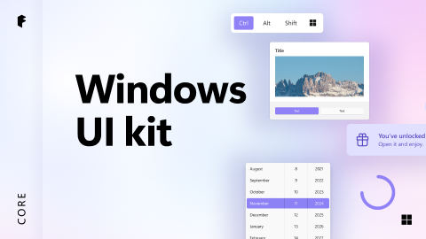

# Windows UI kit (Community)

**Source:** Figma file `gngcSNotsStVdOdZD9zff5`
**Captured:** 2026-05-19
**Priority:** skip
**Status:** stub — not yet absorbed

## Pages (21)

- `2434:129659` — Cover _(1 top-level frames)_
- `30372:118258` — Read me _(1 top-level frames)_
- `31836:0` — Change Log _(1 top-level frames)_
- `29792:125378` — Table of Contents _(1 top-level frames)_
- `71172:256927` — Templates & Tasks _(3 top-level frames)_
- `165332:67172` — Guidance & Charts _(15 top-level frames)_
- `32021:96` — Shell _(7 top-level frames)_
- `169220:24874` — App UI Examples _(1 top-level frames)_
- `129569:160148` — ——— _(0 top-level frames)_
- `72491:280391` — Basic input _(32 top-level frames)_
- `72491:280400` — Date & time _(3 top-level frames)_
- `72491:280394` — Dialogs & flyouts _(3 top-level frames)_
- `72491:280393` — Lists & collections _(9 top-level frames)_
- `72491:280401` — Media _(2 top-level frames)_
- `72491:280398` — Menus & toolbars _(5 top-level frames)_
- `72491:280399` — Navigation _(4 top-level frames)_
- `72491:280396` — Scrolling _(4 top-level frames)_
- `72491:280402` — Splash screen _(1 top-level frames)_
- `72491:280397` — Status & info _(4 top-level frames)_
- `72491:280395` — Text fields _(6 top-level frames)_
- `238:0` — Primitives _(7 top-level frames)_

## Skip

_TBD_

## Absorb

_TBD_

## Tension

_TBD_

## Decisions

_None yet._

## Open follow-ups

- Render previews of priority pages and write per-page NOTES.md
